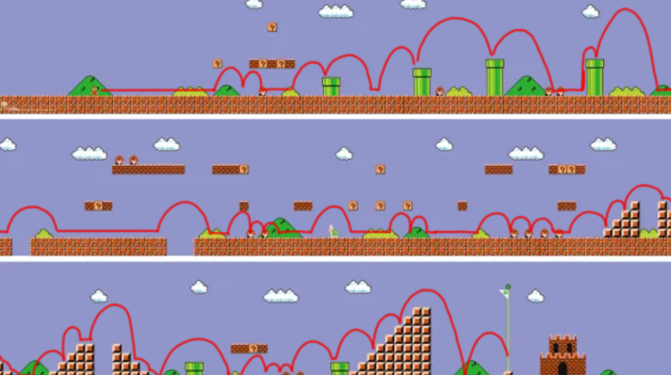

# Rule Based Algorithm on gym-super-mario-bros environment

Project was last updated on: 16 October 2023

**This was a university project for an Agents, Algorithms and AI unit.**

## Project Overview

The Super Mario Project of Agents, Algorithms and AI, makes use of the gym-super-mario-bros environment to introduce the practical use of various algorithms to be implemented into agents. The aim of the project is not only to apply learnt algorithms, but to also directly analyze the performance and efficiency of these agents.

Given the gym-super-mario-bros environment, we were tasked to implement at least two separate algorithms to our agent, Mario, to move as far into the level as possible. The Rule-Based agent was chosen as one of the implemented agents due to its intuitive rule-making strategy and its simplicity, provided the OpenCV code.

The Rule-Based agent makes use of the OpenCV code (provided by Lauren Gee) to extract the agent’s coordinates, as well as the obstacles’ coordinates, to have the agent make decisions based on the distance between the two. 

All the rules follow a similar pattern where if an obstacle is detected within 70 pixels of the agent’s coordinates, it will jump and continue on to the right. The specific rules are as follows:

> If no obstacles are detected, keep moving right.
> If a pipe is detected in front, stop moving and jump over the pipe.
> If an enemy is detected in the same x-coord and around 10 pixels above the agent, stop moving and jump over the enemy.
> If a block is directly in front of the agent, stop moving right and jump over the block.
> If there is a gap in the ground nearby the agent and the agent is on the ground, jump over the gap.

gym-super-mario-bros environment Copyright (c) 2018 Christian Kauten included. I have not included anything else from the original folder.

